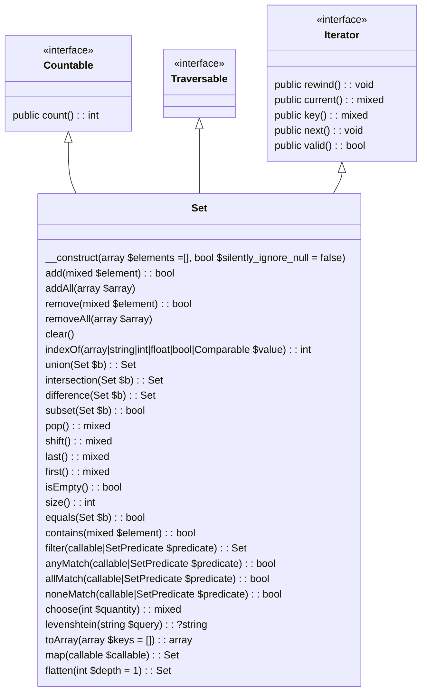
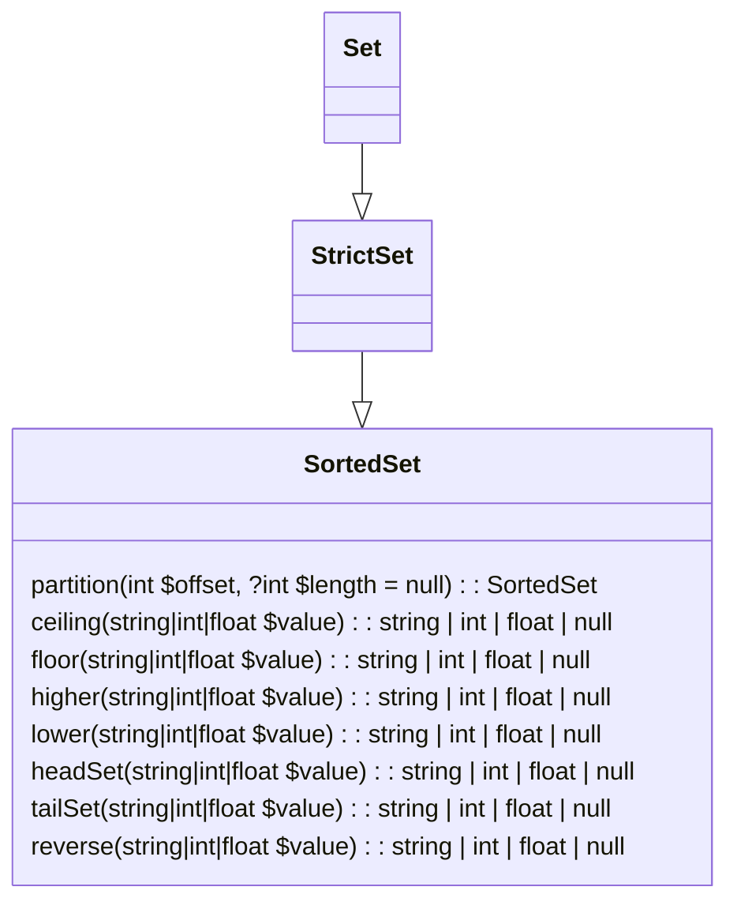

PHP lightweight hashtable (associative array) wrapper for Set data structures.

Sets are effectively containers that hold unique values.

## Excogitation

**What is 'unique'?**

Unique is determined by this package via a hashed value for any given input. The hash value is generated internally for continuity. The hashed value is then used as a way to identify a hashtables element/value

**Why create an internal hash code?**
**Why not use built-in `spl_object_hash` or `hash`**

There are many reasons why not to rely on these values, but fundamentally, they don't guarantee uniqueness.

Take for example:

```php
$aStd = new stdClass;
$aStd->foo = "foobar";

$bStd = new stdClass;
$bStd->foo = "foobar";
```

The two objects are considered equal because they have the same amount of properties, the properties value's are identical and they both are derived stdClass objects.

However, the result of the 2 hashes:

```
var_dump(spl_object_hash($aStd)); //00000000000000010000000000000000
var_dump(spl_object_hash($bStd)); //00000000000000020000000000000000
```

Additionally `spl_object_hash` only allows objects and `hash|md5 etc` expect strings, not all objects include `__toString()` logic.

In short, this is a very complex problem to solve because uniqueness is never not guaranteed, but the hash *can* and *should* limit potential collisions which the package strives for

## Installation

`composer require ft/sets`

## Set Classes

### `Set`
A container that can hold zero to many elements of any data type

<details open>
    <summary>Class Diagram</summary>


</details>

### `StrictSet`

A subclass of Set, which only permits the same data type to exist in a given instance

> **Note**
> The first element added to a StrictSet dictates what type of elements can be added subsequently

When a StrictSet element is added that is not the same type an `InvalidArgumentException` will be thrown. Subclasses of an element are not even permitted

### `SortedSet`

A sorted set is one which the values are sorted in ascending order, or descending if elected.
Therefore sorted sets must contain the same elements (a la `StrictSet`)

Additional functions are provided for numerical data types

> **Warning**
> There is no locale integration for string comparisons, that's beyond the scope of this library

<details open>
    <summary>Class Diagram</summary>


</details>

## Examples

### Set

```php
$car = new stdClass;
$car->make = 'toyota';

$set = new Set;
$set->add(1);
$set->add(2.);
$set->add('foobar');
$set->add('foobar');
$set->add(new stdClass);
$set->add(new stdClass);
$set->add(true);
$set->add(true === true);
$set->add($car);

var_dump($set->toArray());
/*
array(4) {
  [0] => int(1)
  [1] => double(2)
  [2] => string(6) "foobar"
  [3] => class stdClass#2 (0) { }
  [4] => class stdClass#3 (1) {
    public $make => string (6) "toyota"
  }
}
*/
```

### SortedSet

```php
$set = new SortedSet;

$set->addAll([
    'pea',
    'pineapple',
    'apple',
    'apple',
    'orange',
    'apple',
    'banana',
    'potato',
    'radish',
    'carrot',
    'pea',
    'apple',
    'pea',
    'bean'
]);

var_dump($set->toArray());
/*
array(9) {
  [0] => string(5) "apple"
  [1] => string(6) "banana"
  [2] => string(4) "bean"
  [3] => string(6) "carrot"
  [4] => string(6) "orange"
  [5] => string(3) "pea"
  [6] => string(9) "pineapple"
  [7] => string(6) "potato"
  [8] => string(6) "radish"
}
*/
```
